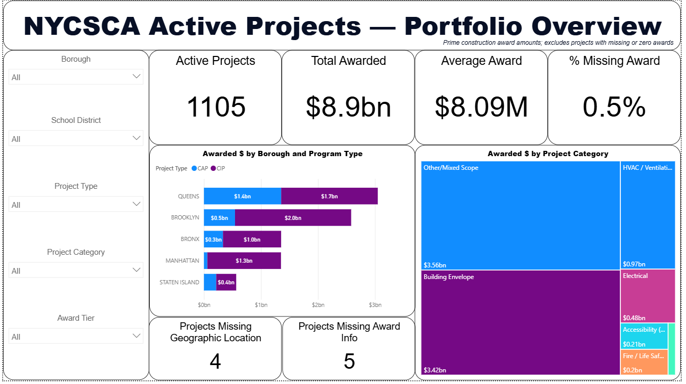
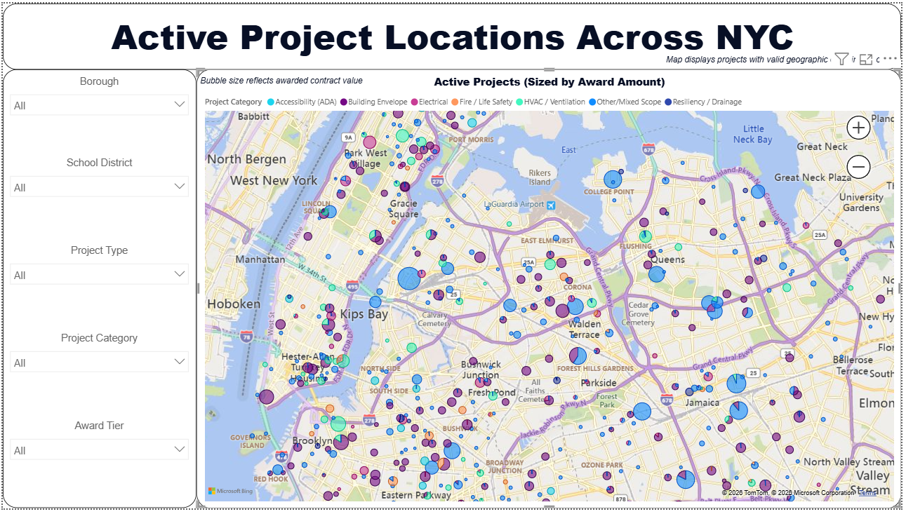
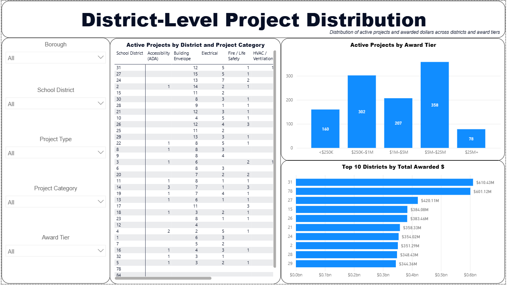
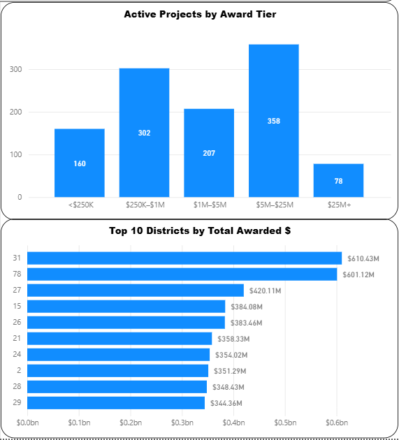

# NYC School Construction Authority (NYCSCA) Dashboard

This Power BI dashboard analyzes active school construction projects across New York City, providing visibility into funding distribution, project concentration, and geographic coverage.

The dashboard is designed to support decision-making by highlighting where investments are being made, how projects are distributed across districts, and where potential data quality gaps exist.

---

## Overview

This project transforms raw NYCSCA project data into an interactive reporting tool that enables users to:

- Analyze construction investment across boroughs and districts  
- Identify high- and low-funded regions  
- Track project distribution by category and award size  
- Detect missing or incomplete data fields  

---

## Tools & Technologies

- Power BI (Data Modeling, DAX, Visualization)
- Power Query (Data Cleaning & Transformation)
- Excel (Source Data)
- Geospatial Mapping (Latitude/Longitude)

---

## Key KPIs

- Total Active Projects: 1,105  
- Total Construction Award: $8.9B  
- Average Award per Project: $8.09M  
- % Missing Award Data: 0.5%  

---

## Dashboard Preview

### Portfolio Overview

### Project Locations Across NYC

### District-Level Analysis

### Funding & Award Analysis

---

## Key Insights

- Construction investment is concentrated in Brooklyn, Queens, and Manhattan  
- The majority of projects fall within the $1M–$25M award range  
- A small percentage of projects are missing award values, indicating minor data quality gaps  
- Certain districts receive significantly higher funding, highlighting uneven investment distribution  
- Geographic clustering reveals dense development zones and potential underserved areas  

---

## Dashboard Features

- **Interactive Filters:** Borough, District, Project Type, Category, Award Tier  
- **Geospatial Map:** Visualizes project locations with bubble size representing award value  
- **KPI Cards:** High-level performance metrics  
- **District-Level Breakdown:** Detailed project distribution by category  
- **Award Tier Analysis:** Distribution of projects by funding size  
- **Top District Analysis:** Identifies highest-funded districts  
- **Data Quality Indicators:** Tracks missing geographic and award data  

---

## Data Notes

- Source: NYC School Construction Authority (NYCSCA) Active Projects dataset (https://data.cityofnewyork.us/Housing-Development/Active-Projects-Under-Construction/8586-3zfm/about_data)
- "Construction Award" represents the value of the prime construction contract  
- Some records contain missing values for award amount or geographic coordinates  
- Data cleaning and transformation performed in Power Query  

---

## Project Goal

This project demonstrates how operational public-sector data can be structured into a scalable reporting framework by:

- Defining meaningful KPIs from raw data  
- Building a structured and reusable data model  
- Incorporating data quality monitoring into reporting  
- Delivering an intuitive dashboard for stakeholder decision-making  

---

## Documentation

- [Dashboard Summary](docs/dashboard_summary.pdf)

---

## Future Improvements

- Add time-series analysis for project timelines  
- Integrate budget vs. actual cost tracking  
- Expand validation rules for data completeness  
- Optimize DAX measures for performance at scale  

---

## Author

Deepta Raghavan  
